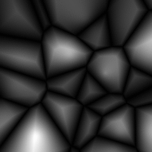
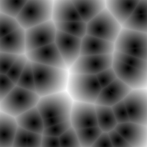
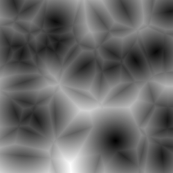
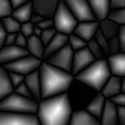
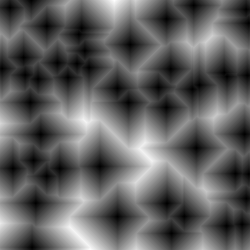
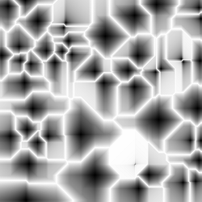

# worley-noise

Worley noise in JavaScript.



## What is it?
Worley noise (also called Voronoi or Cell noise) is a type of noise where the value of a point is based on its distance to a set of previously placed points. By using the distance to the closest point it produces images like this:



But we don't have to use the closest point, we can choose the second, third, etc. We can even combine these values by performing mathematical operations on them like addition and subtraction:

 

The previous images were generated by using the Euclidean distance for the calculations. If we use Manhattan distance we get quite different results:

 

The formula for generating these images can be found in the advanced example.

## Getting started
Download [worley-noise.js][max].

[max]: https://raw.githubusercontent.com/zsoltc/worley-noise/dev/dist/worley-noise.js

Example usage:

```html
<script src="worley-noise.js"></script>
<script>
// Creates a new noise instance with 10 randomly placed points.
// seed: optional argument for reproducibility.
// dim: dimension (defaults to 2).
// Coordinates range from (0, 0) to (1, 1).
var noise = new WorleyNoise({
    numPoints: 10,
    /*seed: 42,*/
    /*dim: 3,*/
});

// Manually adds a point to the center.
noise.addPoint({ x: 0.5, y: 0.5 });

// Gets Euclidean noise value at (0.3, 0.4).
// The third argument (k) defines which point should be chosen when calculating the distance.
// As k=1 in this case, the closest point is chosen.
console.log(noise.getEuclidean({ x: 0.3, y: 0.4 }, 1));

// Gets Manhattan noise value at (0.3, 0.4).
// As k=2 in this case, the 2nd closest point is chosen.
console.log(noise.getManhattan({ x: 0.3, y: 0.4 }, 2));

// Creates an 5x5 array with the computed noise values.
var width = 5;
var img = noise.renderImage(width);

// Gets value at (3, 2).
// (3, 2) corresponds to (3 / (5 - 1), 2 / (5 - 1)) -> (0.75, 0.5).
console.log(img[2 * width + 3]);

// Creates a normalized array where values have been scaled to be between 0 and 1.
img = noise.renderImage(width, { normalize: true });

// Uses custom function for noise value calculation.
// It sums the Euclidean distance to the closest point
// and the Manhattan distance to the second closest point.
img = noise.renderImage(width, {
    normalize: true,
    callback: function (e, m) { return e(1) + m(2); }
});
</script>
```
Canvas examples can be found in the project.

## Development

Install dependencies:
```
npm install
```
Create a dev build:
```
npm run dev
```

Create a minified build:
```
npm run build
```
